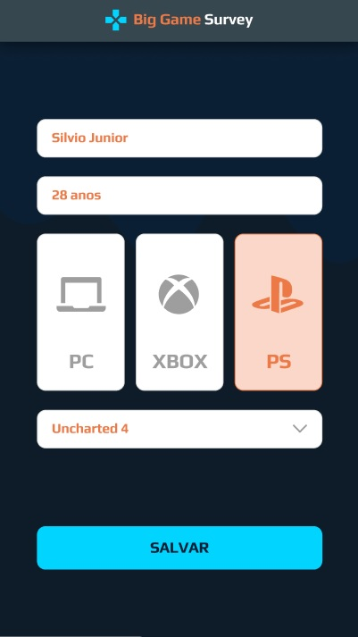

## 💻 Sobre

O projeto foi desenvolvido com o intuito de desenvolver habilidades em criação de Web Services além de manipular seus dados através de um back-end que tem como objetivo criar dados com um front-end Mobile e visualizar essas informações em um front-end Web através de tabelas e gráficos.

A plataforma BigGame Survey foi desenvolvida para que os usuários através de um aplicativo móvel, votem em seus jogos, gêneros e plataformas favoritas. Para isso um cadastro básico contendo nome e idade é necessário, que posteriormente poderão ser consultados através de tabelas e gráficos que mostrarão quais os jogos e gêneros foram mais votados e em quais plataformas os usuários preferem jogar.

---

### 🎨 Layout

<strong> 🖥 WEB </strong>

 
 
 

<strong> 📱 MOBILE </strong>

 
Início | Cadastro 
---|---
 | 

---

### 🛠 **Tecnologias**

As seguintes ferramentas foram utilizadas na construção do projeto:
- [Java 11](https://www.java.com/pt-BR/)
- [Spring Boot](https://spring.io/)
- [PostgreSQL](https://www.postgresql.org/)
- [ReactNative](https://reactnative.dev/)
- [ReactJS](https://pt-br.reactjs.org/)
- [HTML5](https://developer.mozilla.org/pt-BR/docs/Web/HTML/HTML5)
- [CSS3](https://developer.mozilla.org/pt-BR/docs/Archive/CSS3)

---

## 🦸 **Autor**

<a href="https://www.linkedin.com/in/gustavo-damaceno/">
 
  
</a> <a href="https://www.linkedin.com/in/gustavo-damaceno/" title="Gustavo Damaceno">Gustavo Damaceno</a>
  

---

### 📝 **Licença**

Copyright © 2020 [Gustavo Damaceno](https://github.com/gustavoddainezi).
Este projeto é licenciado pelo [MIT](./LICENSE).
